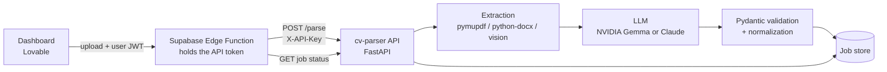

# cv-parser

Turn a resume (`.pdf`, `.docx`, `.jpg`, `.jpeg`, `.png`) into structured JSON. Built to feed a talent-bank dashboard:
upload a file, get back a validated record with contact info, skills, experience, projects, education, languages and
certifications.

It handles text PDFs, scanned PDFs, Word files and photos (including handwritten resumes), in any language, and keeps
the original language of the content.

## How it works



1. **Extraction** depends on the file type:
   - **DOCX**: paragraphs, tables and page headers (where contact info often lives) via `python-docx`.
   - **PDF**: text via `pymupdf`. If the PDF has almost no text (a scan), the pages are rendered to images instead.
   - **JPG / PNG**: sent straight to a vision-capable model. There is no separate OCR step.
2. **Structuring**: an LLM fills a fixed JSON schema. Claude uses forced tool use; the NVIDIA provider uses JSON mode
   with one retry when the output is invalid.
3. **Validation and normalization**: the output is validated with Pydantic, skills are de-duplicated
   (case-insensitive), and experience, projects and education are sorted most recent first.
4. **Async delivery**: parsing can take from 30 seconds to a few minutes, so `POST /parse` returns a job id right away and
   the client polls for the result.

## Example output

```json
{
  "full_name": "Maria Souza",
  "headline": "Backend Developer",
  "email": "maria.souza@example.com",
  "location": "São Paulo, SP",
  "skills": ["Python", "FastAPI", "PostgreSQL", "Docker"],
  "soft_skills": ["Leadership", "Communication"],
  "experience": [
    {
      "company": "Acme",
      "title": "Senior Software Engineer",
      "start_date": "2021-03",
      "end_date": "present",
      "highlights": ["Led the migration to microservices"]
    }
  ],
  "projects": [],
  "education": [
    { "institution": "USP", "degree": "Bachelor", "field_of_study": "Computer Science",
      "start_date": "2014", "end_date": "2017" }
  ],
  "languages": [{ "name": "English", "level": "advanced" }],
  "certifications": []
}
```

Fields missing from the resume come back as `null` or `[]`; nothing is invented. Dates use `YYYY-MM` (or `YYYY`), and
an ongoing role has `end_date: "present"`. The full schema is in [`cv_parser/schema.py`](cv_parser/schema.py).

## API

All routes except `/health` require the header `X-API-Key: <CV_PARSER_API_TOKEN>`.

| Route | Description |
|---|---|
| `POST /parse` | `multipart/form-data` with a `file` field. Returns `202 {"job_id", "status": "queued"}`. |
| `GET /jobs/{job_id}` | `status` is `queued`, `processing`, `done` or `error`. On `done`, `result` holds the JSON. |
| `GET /health` | Liveness check. |

```bash
JOB=$(curl -s -H "X-API-Key: $TOKEN" -F "file=@resume.pdf" "$BASE_URL/parse" | jq -r .job_id)
curl -s -H "X-API-Key: $TOKEN" "$BASE_URL/jobs/$JOB"
```

Errors on upload: `401` bad token, `413` file over 10 MB, `415` unsupported type. Jobs are kept for one hour.

## Run locally

```bash
python -m venv .venv && source .venv/bin/activate    # Windows: .venv\Scripts\activate
pip install -r requirements.txt
cp .env.example .env                                  # add your API key(s)

python -m cv_parser resume.pdf -o out.json            # CLI
uvicorn cv_parser.api:app --port 8000                 # HTTP API
```

As a library: `from cv_parser import parse_resume; parse_resume("resume.docx").model_dump()`.

### Configuration

| Variable | Purpose |
|---|---|
| `CV_PARSER_PROVIDER` | `nvidia` (default model `google/gemma-4-31b-it`) or `anthropic` (default `claude-sonnet-5-5`). |
| `NVIDIA_API_KEY` / `ANTHROPIC_API_KEY` | Key for the chosen provider. |
| `CV_PARSER_MODEL` | Override the model name. |
| `CV_PARSER_API_TOKEN` | Token clients must send in `X-API-Key`. |
| `CV_PARSER_WORKERS` | Parallel parsing jobs (default 3). |

## Deployment

A `Dockerfile` is included, plus a `docker-compose.yml` that runs the API behind Caddy with automatic HTTPS
(set `DOMAIN` in `.env`). Any host that runs containers works; keep it to a single instance, since jobs are stored in
memory.

The browser must never call this API directly, because that would expose the token.
[`supabase/functions/cv-parser`](supabase/functions/cv-parser/index.ts) is a small Edge Function that acts as the proxy:
it requires a signed-in user, keeps the token server-side, and forwards uploads and status checks.

## Design decisions and limitations

- **Async jobs instead of a long request.** Model calls are slow and variable, and gateways time out. Trade-off: jobs live
  in memory, so a restart drops the ones in flight and the service must run as a single instance. Moving the job store to
  a database is the natural next step.
- **Two providers behind one interface.** The NVIDIA API has a free tier that is enough for prototyping; Claude gives
  better results on complex layouts. Switching is one environment variable.
- **Vision instead of a separate OCR step** for images and scanned PDFs, which keeps the pipeline short and handles
  layouts that plain OCR scrambles.
- **Accuracy is not measured yet.** It was checked by hand on a handful of resumes (text PDF, handwritten photo, DOCX), not
  against a labeled dataset. Treat the output as a first pass that a human can review.
- **Privacy.** Resumes are personal data and are sent to the configured LLM provider. Get consent and review the
  provider's data policy before using real candidate data.

## Project layout

```
cv_parser/
  schema.py     Pydantic models and normalization
  extract.py    File -> text / image blocks
  parser.py     LLM providers and output validation
  api.py        FastAPI app, async job queue
  __main__.py   CLI
supabase/functions/cv-parser/   Edge Function proxy
Dockerfile, docker-compose.yml, Caddyfile
```

## License

[MIT](LICENSE)
